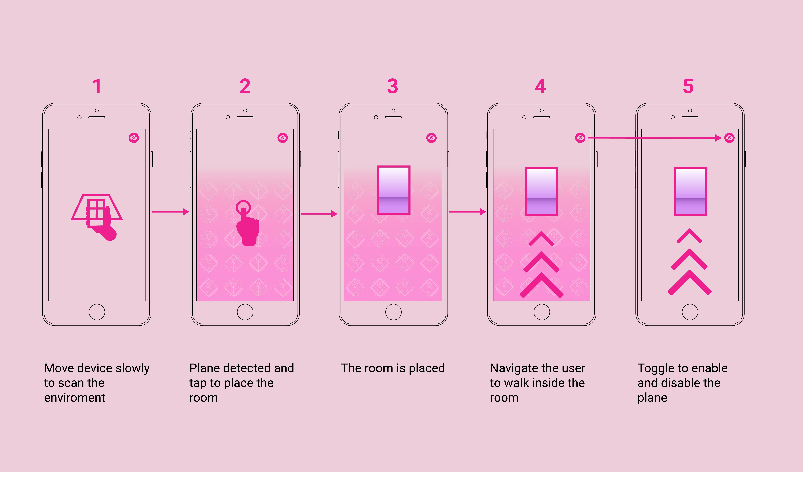
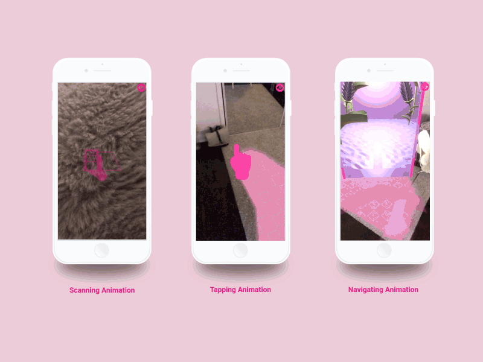

# DreamWorld AR
### Summary 
DreamWorld AR is an experimental personal project exploring the boundary between virtual and real worlds.

[View Project]( https://yiyishao.org/DreamWorld.html)

### Goal
Design an user-friendly interface for the AR app. Inspired by Vishnu Ganti's UI/UX for hand-held AR and Tevfik Ufuk DEMİRBAŞ's AR Portal. It is created using Unity3D, ARFoundation, ARKit, Xcode, Illustrator and Photoshop.

### Action
#### 1. User Flow

#### 2. Animation

